# Guide de la paie sénégalaise dans Odoo

Destiné au gestionnaire de paie. Il couvre le cycle mensuel complet : préparer un salarié,
produire les bulletins, contrôler, corriger, et sortir les états à déposer.

Les congés ne sont pas traités ici : ils fonctionnent comme dans n'importe quelle
installation d'Odoo, et la documentation officielle d'Odoo les couvre. Ce guide ne décrit
que ce qui est propre à la paie sénégalaise.

---

## 1. Préparer un salarié

**Employés → Employés → Nouveau.** Renseigner l'identité, le département et le poste,
puis ouvrir l'onglet **Paie**.

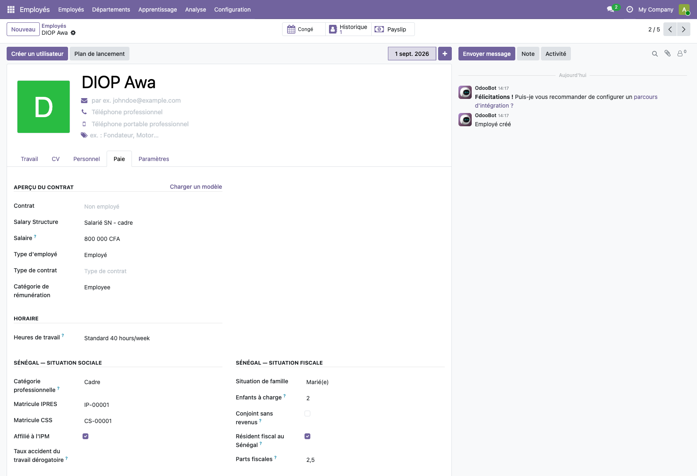

Un mot sur ce que vous voyez en haut du formulaire : la date encadrée et le bouton **+**.
Les conditions d'emploi d'un salarié sont datées. Augmenter un salaire au 1er janvier ne se
fait donc pas en corrigeant la fiche, mais en ouvrant de nouvelles conditions à cette
date : les bulletins déjà émis gardent celles de leur époque, et se recalculent toujours
juste. Le bouton **Historique** montre ces conditions successives.

Quatre informations conditionnent le calcul :

| Information | Ce qu'elle change |
|---|---|
| **Structure de salaire** | *Salarié SN - cadre*, *non-cadre* ou *Stagiaire SN*. Le cadre déclenche le régime complémentaire IPRES. |
| **Catégorie professionnelle** | Doit concorder avec la structure choisie. |
| **Situation de famille** et **enfants à charge** | Déterminent le nombre de parts, donc l'impôt. Les parts se calculent seules et restent modifiables pour les cas particuliers. |
| **Matricules IPRES et CSS** | Sans eux, la déclaration nominative sera incomplète. |

Le salaire de base se saisit dans les informations de rémunération du contrat.

**La date d'embauche n'est pas facultative.** Sans elle, le salarié n'a pas de contrat en
cours, et la section 3 montre ce qu'il advient alors de la paie du mois.

## 2. Le cycle du mois

| | Opération | Où |
|---|---|---|
| 1 | Créer le lot du mois et générer les bulletins | Paie → Bulletins → Lots de bulletins de paie |
| 2 | Enregistrer les absences du mois | Congés |
| 3 | Saisir les éléments exceptionnels | dans chaque bulletin concerné |
| 4 | Contrôler les montants | Paie → Rapports et états → État de paie |
| 5 | Confirmer le lot entier | bouton **Mark As Done** du lot |
| 6 | Éditer les bulletins et sortir les états | Paie → Rapports et états → États mensuels et bordereaux |

Les étapes 1 à 4 se refont autant de fois que nécessaire : tant que les bulletins sont en
brouillon, ils ne comptent nulle part. C'est l'étape 5 qui engage — elle confirme,
et elle écrit en comptabilité.

## 3. Produire les bulletins du mois

### La paie du mois, par lot

C'est la voie normale : un lot par mois, tous les salariés dedans.

**Paie → Bulletins → Lots de bulletins de paie → Nouveau.** Nommer le lot — « Paie 09/2026 » —, fixer
la période du 1er au dernier jour du mois, puis **Générer les bulletins de paie**.

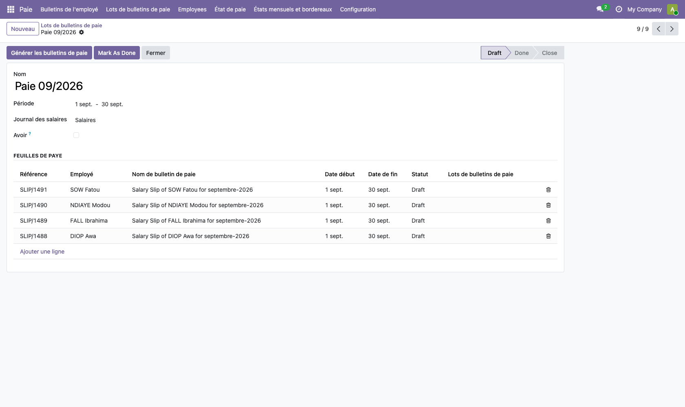

Une fenêtre s'ouvre et demande les salariés. **Elle n'en propose aucun** : la liste est
vide.

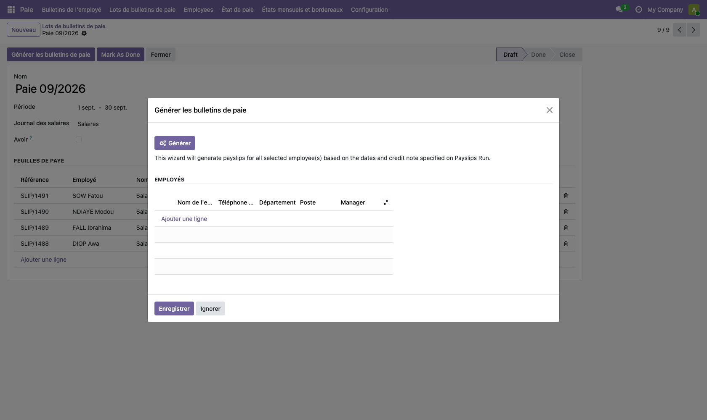

Cliquez **Ajouter une ligne** : la liste des salariés s'ouvre. La case en tête de colonne
les coche tous d'un coup, puis **Sélectionner** les ramène dans la fenêtre. Il ne reste
qu'à cliquer **Générer**.

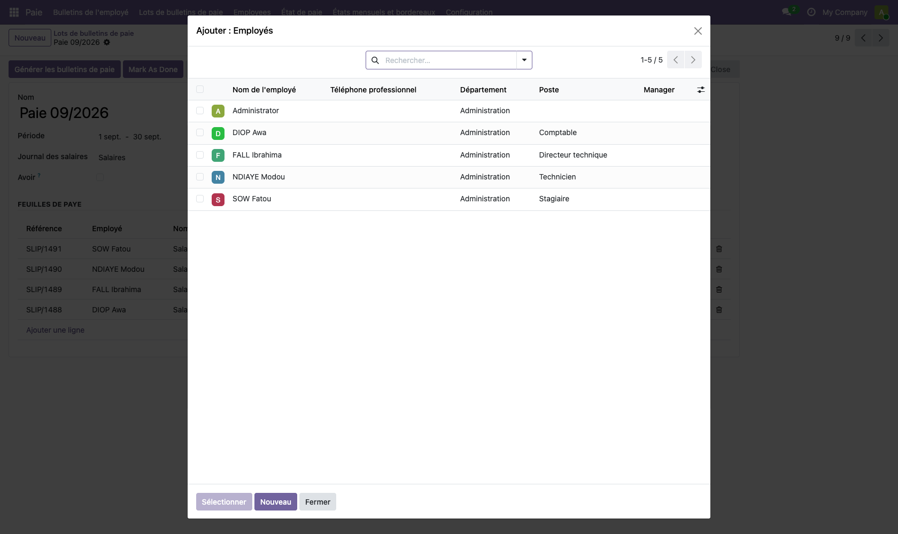

Quatre choses à savoir, chacune constatée à l'usage :

**Un seul salarié sans contrat en cours fait échouer tout le lot.** Un message d'erreur
apparaît, nommant ce salarié, et rien n'est créé — pas même pour les autres. C'est le cas
d'une fiche sans date d'embauche, ou d'un salarié dont le contrat s'est terminé avant la
période. Retirez-le de la sélection, ou complétez sa fiche.

**Les éléments récurrents du contrat sont repris tout seuls** — sursalaire, prime
d'ancienneté, indemnité de transport. Vous n'avez à saisir que l'exceptionnel du mois.

**« Fermer » ne confirme rien.** Le bouton **Fermer** ferme le lot et laisse les bulletins
en brouillon : ils resteront absents des états, des cumuls, et du calcul de l'impôt du mois
suivant. Ce n'est pas l'action de fin de mois.

**« Mark As Done » est l'action de fin de mois.** Elle recalcule chaque bulletin, les
confirme tous, et **produit les écritures comptables dans la foulée** — une par bulletin.
D'où l'ordre : contrôler avant, jamais après. Ce bouton est le seul de l'écran resté en
anglais.

Un lot ne se supprime qu'en brouillon. Un lot confirmé se défait bulletin par bulletin.

### Un bulletin isolé

**Paie → Bulletins → Bulletins de l'employé → Nouveau**, choisir le salarié et la période. La structure
vient du contrat.

C'est la voie de l'exception : une embauche en cours de mois oubliée du lot, un solde de
tout compte, un rappel. Pour la paie courante, préférez le lot — il garantit que personne
n'est oublié et que tous les bulletins portent la même période.

### Saisir les éléments variables

Dans le bulletin, onglet **Jours travaillés et entrées**. Les codes :

| Code | Rubrique |
|---|---|
| `SURSAL` | Sursalaire |
| `ANC` | Prime d'ancienneté |
| `PRIME` | Primes et gratifications |
| `TRANSPORT` | Indemnité de transport |
| `AVANCE` | Avance sur salaire à retenir |
| `CASH` | Acomptes remis en espèces à retenir |

Après toute saisie, **Calculer la feuille** : une prime ajoutée sans recalcul n'apparaît
pas dans le net. La confirmation du lot recalcule elle aussi, mais contrôler un montant
qu'on n'a pas vu recalculé n'a pas de sens.

**La prime de performance se saisit dans `PRIME`.** Elle varie d'un mois sur l'autre et
d'un salarié à l'autre : c'est précisément à cela que sert une entrée de saisie. Le
montant à inscrire est le **brut** — voyez la section 7 si vous ne connaissez que le net.

**`AVANCE` et `CASH` ne se confondent pas.** Les acomptes remis en espèces au fil du mois
vont dans `CASH`. Une avance sur salaire, elle, se déclare une fois pour toutes et se
retient d'elle-même : section 4.

### Lire un bulletin

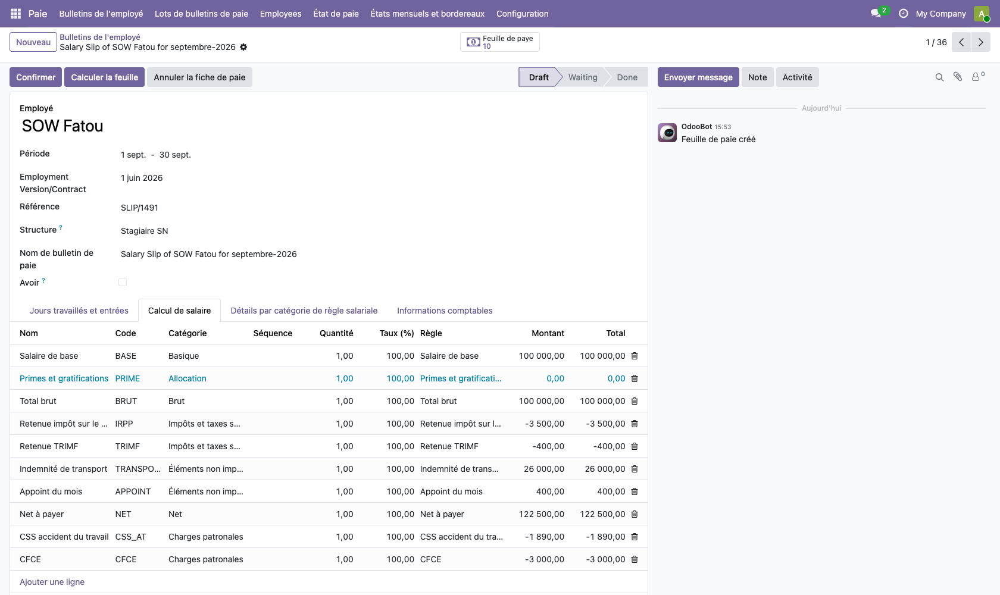

Onglet **Calcul de salaire** : les gains d'abord, puis le **Total brut**, puis les retenues
salariales en négatif — IPRES, IPM, impôt, TRIMF — et enfin le net. Les charges patronales
figurent plus bas ; elles ne diminuent pas le net.

## 4. Absences et avances

### Une absence se saisit en congé, pas au bulletin

N'écrivez pas le nombre de jours dans le bulletin : enregistrez l'absence comme un congé,
et le bulletin suivra tout seul. **Congés → Nouveau**, le salarié, le type, les dates —
puis approuvez.

Au calcul du bulletin, l'absence apparaît sur sa propre ligne, à côté du travail effectif,
et le salaire baisse à proportion.

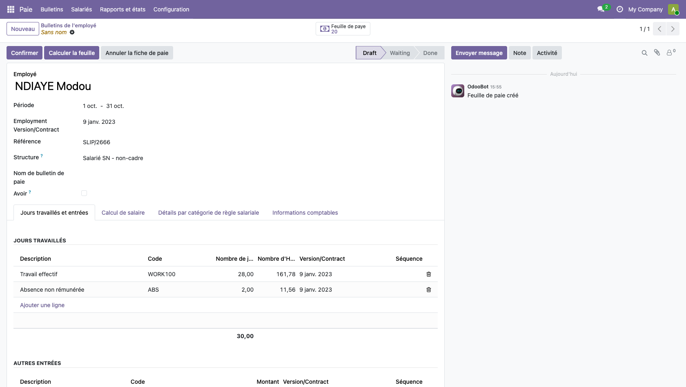

Deux jours d'absence, et le travail effectif tombe à 28 jours : le total reste de 30,
mais seuls 28 sont payés. Trois jours d'absence non rémunérée retirent trois
trentièmes du mois. Les cotisations et l'impôt suivent : une absence allège les charges
autant que la paie.

| Type de congé | Effet sur la paie |
|---|---|
| Congé annuel | aucun — le salaire est maintenu |
| Absence non rémunérée | le salaire baisse d'autant |
| Congé maladie, maternité, permission | selon le taux réglé en configuration |

Ce comportement se règle par type, dans **Congés → Configuration → Types de congés**,
champ **Maintien du salaire** : 1 pour un congé payé, 0 pour une absence sèche, 0,5 pour
une demi-solde.

> Un congé annuel exige un compteur ouvert : Odoo refuse la demande si le salarié n'a pas
> d'attribution. Une absence non rémunérée, elle, se pose sans compteur.

### Une avance sur salaire se déclare une fois

**Paie → Salariés → Avances sur salaire → Nouveau.** Le montant avancé, la retenue
mensuelle, le mois de départ. Puis **Mettre en cours**.

À partir de là, chaque bulletin confirmé retient l'échéance et diminue le solde. La
dernière est ramenée au reste à devoir — on ne retient jamais plus que ce qui est dû — et
l'avance se clôt d'elle-même.

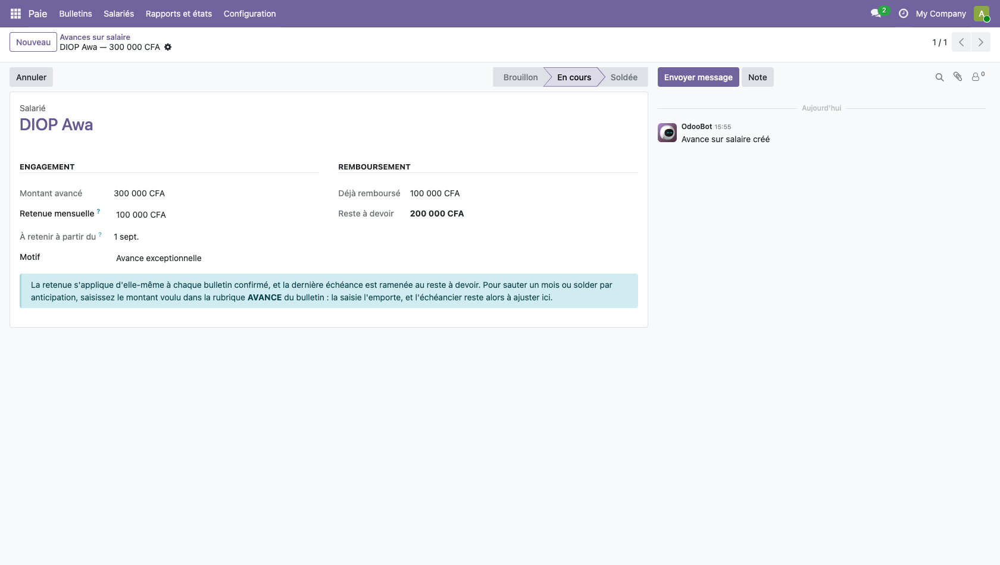

L'écran montre à tout moment ce qui a été remboursé et ce qui reste. Plus de solde tenu
de tête.

> Pour sauter un mois ou solder par anticipation, saisissez le montant voulu dans la
> rubrique `AVANCE` du bulletin : la saisie l'emporte. Mais elle ne touche pas au solde —
> il reste à ajuster sur la fiche de l'avance.

## 5. Comprendre l'impôt

L'impôt n'est pas recalculé de zéro chaque mois. Il est établi sur la **moyenne des bruts
depuis janvier**, projetée sur l'année, sous déduction de ce qui a déjà été retenu.

Conséquence pratique : le mois qui suit une prime exceptionnelle affiche un impôt plus
faible, parce que la moyenne annuelle redescend. C'est normal, et c'est ce qui évite la
régularisation brutale de décembre.

Une retenue **négative** est possible : c'est un remboursement au salarié.

Ce mécanisme repose sur les mois précédents. Un bulletin de mars resté en brouillon fausse
l'impôt d'avril, sans qu'aucun message ne le signale.

## 6. Contrôler

**Paie → Rapports et états → État de paie** ouvre un tableau croisé : salariés en lignes, rubriques en colonnes.

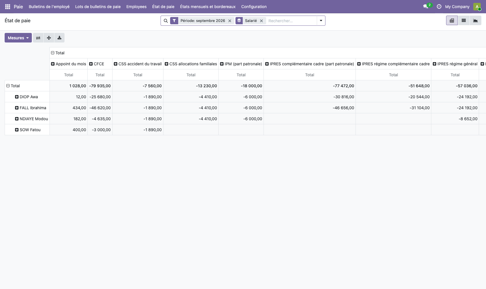

Il se filtre par période et par département, se regroupe autrement d'un clic, et chaque
montant se creuse jusqu'au bulletin. Le bouton de téléchargement exporte la vue en tableur.

C'est l'outil du contrôle quotidien : vérifier qu'aucune rubrique ne manque, qu'un total
n'a pas dérapé, comparer deux mois.

Le contrôle se fait **avant** de confirmer le lot. Après, il faut passer par la section 8.

## 7. Simuler avant de décider

**Paie → Salariés → Simulateur de salaire.** Il calcule par le moteur de paie lui-même :
ce qu'il annonce est ce que donnera le bulletin. Rien n'est enregistré.

Deux usages, et il ne faut pas les confondre.

### Un candidat à l'embauche

Choisissez **Profil hypothétique**. Vous saisissez une structure, une catégorie, un
salaire — le simulateur répond le net et le coût employeur. C'est correct pour quelqu'un
qui n'a pas encore de fiche.

En sens inverse, indiquez le **net souhaité** : il calcule le sursalaire à servir pour
l'atteindre.

### Un salarié déjà en place

Choisissez **Salarié existant**, puis le salarié et le mois. C'est indispensable dès que
la personne a été payée dans l'année : l'impôt se calcule sur la moyenne des rémunérations
depuis janvier, et un profil hypothétique, qui n'a pas de passé, donne un résultat faux.

**Pour une prime dont vous ne connaissez que le net** — le cas courant quand le montant
vous arrive déjà net : sens **Du net vers le brut**, saisissez la **prime nette
souhaitée**. Le simulateur répond la **prime brute à verser**, celle que vous inscrirez
dans la rubrique `PRIME`. Il affiche aussi ce que la prime coûte réellement à
l'entreprise, charges patronales comprises.

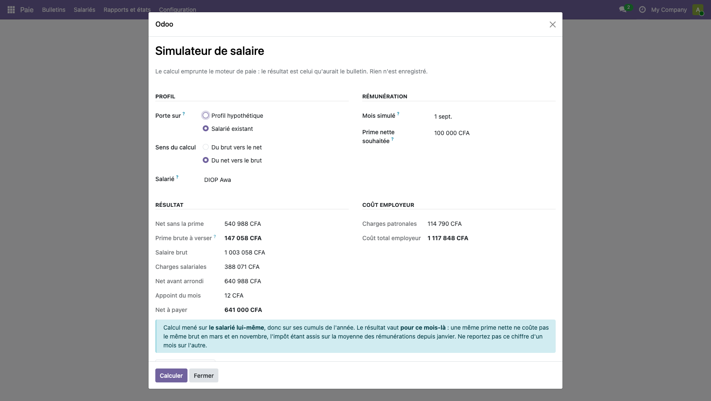

Ici, 100 000 F nets de prime supposent d'en verser 147 058 bruts : l'écart absorbe la
retraite, la mutuelle et l'impôt du salarié.

> Le résultat vaut **pour le mois simulé**. Une même prime nette ne coûte pas le même brut
> en mars et en novembre, puisque le cumul annuel de l'impôt a bougé entre-temps. Ne
> reportez pas un chiffre d'un mois sur l'autre : refaites la simulation.

## 8. Corriger un bulletin

Ce qui est possible dépend de l'état du bulletin.

| État | Correction |
|---|---|
| **Brouillon** | Modifier, puis **Calculer la feuille**. Rien n'a été engagé. |
| **En attente** | Idem : les boutons **Confirmer** et **Calculer la feuille** restent accessibles. C'est l'état des bulletins repris de l'ancien outil. |
| **Fait** | Le bulletin est confirmé et son écriture est passée. Deux voies, ci-dessous. |

**L'avoir** — bouton **Avoir** sur un bulletin confirmé. Il crée un second bulletin, copie
du premier avec tous les montants en sens inverse, et le confirme aussitôt. Les deux
bulletins subsistent, l'écriture d'origine est neutralisée par une écriture symétrique.
C'est la voie propre : elle laisse une trace, et c'est celle qu'attend un contrôle.

**L'annulation** — bouton **Annuler la fiche de paie**. Le bulletin passe en annulé et son
écriture est annulée. À réserver à l'erreur constatée immédiatement, sur un mois non encore
déclaré.

Dans les deux cas, l'impôt des mois suivants s'appuyant sur les cumuls, un bulletin corrigé
en cours d'année se répercute sur le mois d'après. C'est le comportement attendu.

## 9. Sortir les états du mois

**Paie → Rapports et états → États mensuels et bordereaux.** Trois documents, au choix.

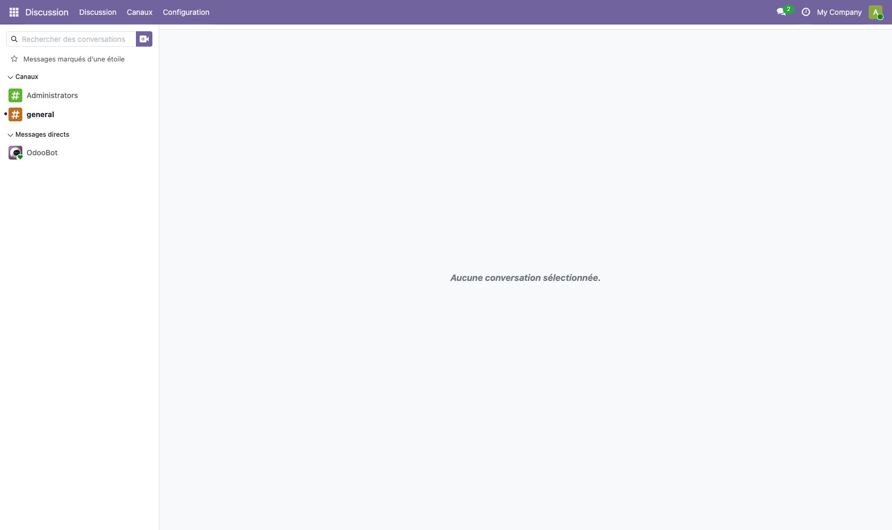

| Document | À quoi il sert | Échéance |
|---|---|---|
| **État global de paie** | Contrôle interne et archivage : une ligne par bulletin, toutes les rubriques, les totaux | Chaque mois |
| **Bordereau de versement au Trésor** | Accompagne le paiement de l'impôt, de la TRIMF et de la CFCE. Porte les mentions obligatoires et ventile les effectifs par nationalité | **15 premiers jours du mois suivant** |
| **État des cotisations sociales** | Récapitulatif IPRES, CSS et IPM avec les assiettes plafonnées, et la déclaration nominative à reporter sur NDAMLI | Selon l'échéance de la caisse |

Seuls les bulletins **confirmés** sont repris. Si un état paraît incomplet, vérifier qu'il
ne reste pas de brouillon.

Le bulletin remis au salarié s'imprime depuis le bulletin lui-même, ou depuis une sélection
dans la liste : **Imprimer → Bulletin de paie (Sénégal)**. Il porte l'en-tête de
l'entreprise, le détail des rubriques, les cumuls annuels, le compteur de congés et les
cases d'émargement qu'exige l'article L.116 du Code du travail.

## 10. Mettre à jour un barème

**Paie → Configuration → Barèmes Sénégal.**

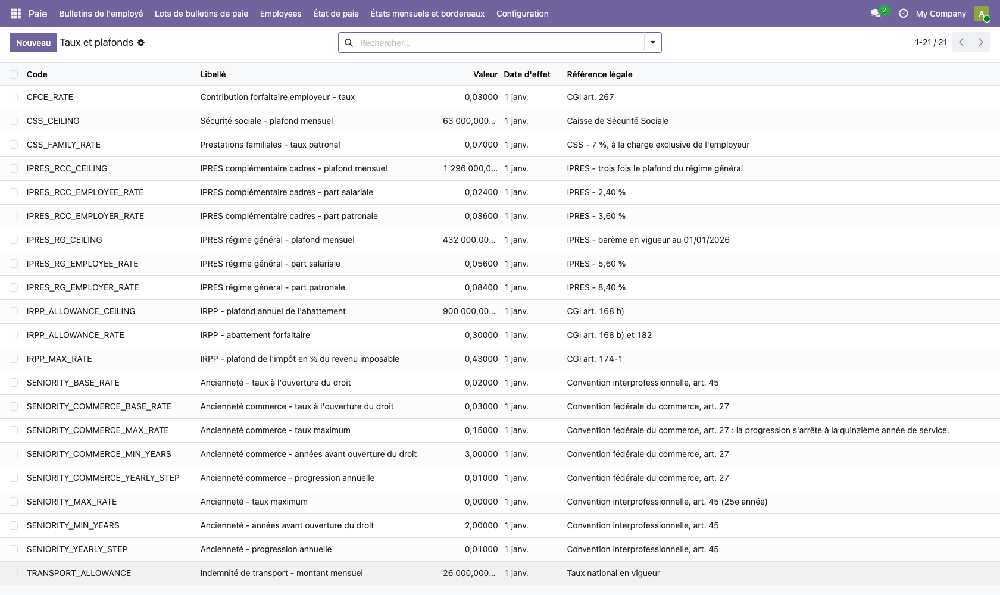

Quatre tables : taux et plafonds, barème de l'impôt, réduction pour charges de famille,
tarifs de la TRIMF. On ne modifie jamais une valeur existante — on **ajoute** une ligne
portant la nouvelle date d'effet, ce qui préserve le recalcul des bulletins antérieurs.

Une marche à suivre détaillée existe par ailleurs, dans le guide de mise à jour des
barèmes.

## 11. Ce qui relève de l'administrateur

**Paramètres → Paie Sénégal** porte les options propres à l'entreprise : taux d'accident du
travail notifié par la CSS, numéros employeur IPRES et CSS, modalités de l'IPM, exonération
éventuelle de CFCE, méthode de calcul de l'impôt, convention collective applicable et
barème de la prime d'ancienneté.

Ces valeurs ne se changent pas sans pièce justificative : elles s'appliquent à tous les
bulletins produits ensuite.

### Créer une nouvelle rubrique

**Paie → Configuration → Règles salariales.** Une rubrique à montant **fixe** ou en
**pourcentage** d'une base se crée sans aucune programmation : c'est à votre portée.

En revanche, une rubrique dont le montant **change chaque mois** — une prime variable, une
retenue ponctuelle — suppose une règle écrite en code, qui lit une entrée de saisie. Ce
n'est pas une lacune de l'outil : la paie d'Odoo fonctionne de la même façon. Passez par
nous.

> **Ne modifiez jamais les rubriques légales** — IPRES, IPM, impôt, TRIMF, CFCE, CSS.
> Elles sont écrites en code et **réécrites à chaque mise à jour du module** : votre
> modification disparaîtrait sans avertissement, et les bulletins produits entre-temps
> seraient faux. Un taux qui change se met à jour par les barèmes, section 10.

Deux réglages commandent la comptabilité :

**Journal de paie.** Le journal où s'écrivent les écritures. Il est renseigné à
l'installation avec le journal que l'entreprise utilisait déjà pour ses salaires, plutôt
que d'en ouvrir un second qui scinderait l'historique.

**Comptabiliser la paie à partir du.** Les bulletins dont la période s'achève **avant**
cette date sont confirmés sans produire d'écriture. C'est ce qui permet de reprendre
l'historique de l'année — dont la comptabilité est déjà passée dans l'ancien outil — sans
la passer une seconde fois.

> À renseigner **avant** la première confirmation. Le réglage n'agit qu'au moment où un
> bulletin est confirmé : il ne rattrape pas les écritures déjà produites.

Exemple : pour que la paie d'août 2026 soit la première comptabilisée, mettre `01/08/2026`.
Juillet et les mois antérieurs se clôtureront alors sans écriture.

---

## En cas de doute

| Symptôme | Cause la plus fréquente |
|---|---|
| Un état sort vide | Bulletins restés en brouillon, ou période mal bornée |
| L'impôt paraît faux | Nombre de parts, ou bulletin d'un mois antérieur non confirmé — le cumul s'appuie dessus |
| Pas de ligne IPRES complémentaire | Le salarié n'est pas en catégorie *cadre*, ou la structure n'est pas celle des cadres |
| Le net ne correspond pas | Une prime saisie sans code, ou saisie après le calcul : recalculer le bulletin |
| La génération du lot échoue en bloc | Un salarié sans date d'embauche, ou dont le contrat est terminé : le retirer de la sélection |
| Le lot est fermé mais les états sont vides | **Fermer** n'est pas **Mark As Done** : les bulletins sont restés en brouillon |
| Aucune écriture comptable après confirmation | La date « Comptabiliser la paie à partir du » est postérieure à la période du bulletin |
| Une absence ne réduit pas la paie | Le congé n'est pas approuvé, ou son **Maintien du salaire** vaut 1 |
| Une avance ne se retient pas | Elle est restée en brouillon : il faut la **Mettre en cours** |
| Le simulateur ne donne pas le même net que le bulletin | Mode **Profil hypothétique** employé sur un salarié déjà payé cette année : passez en **Salarié existant** |
